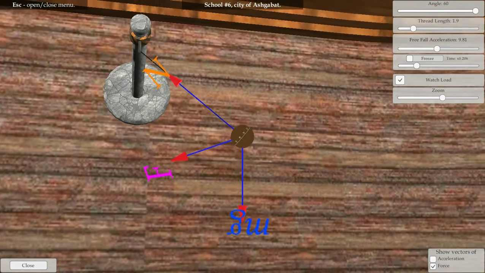
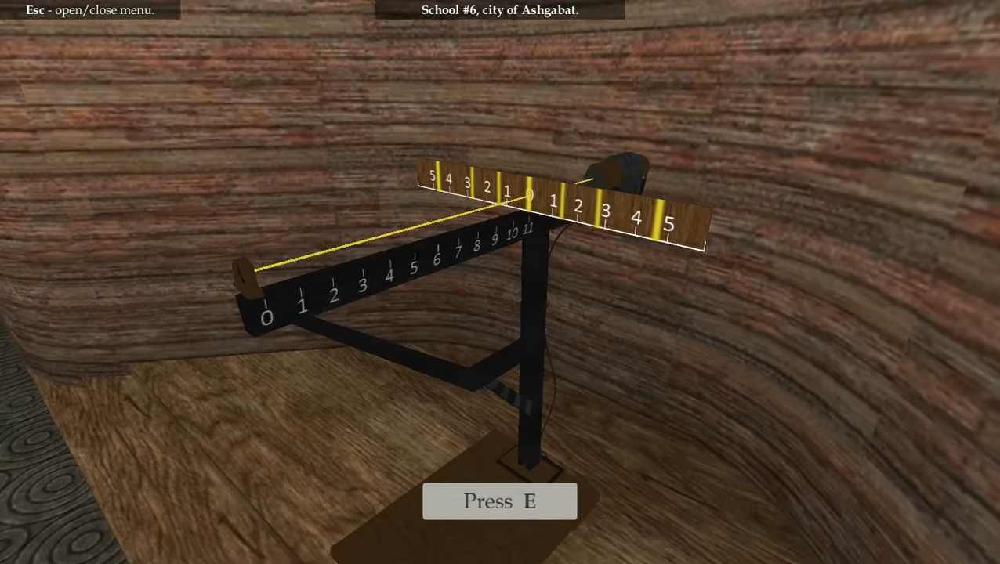
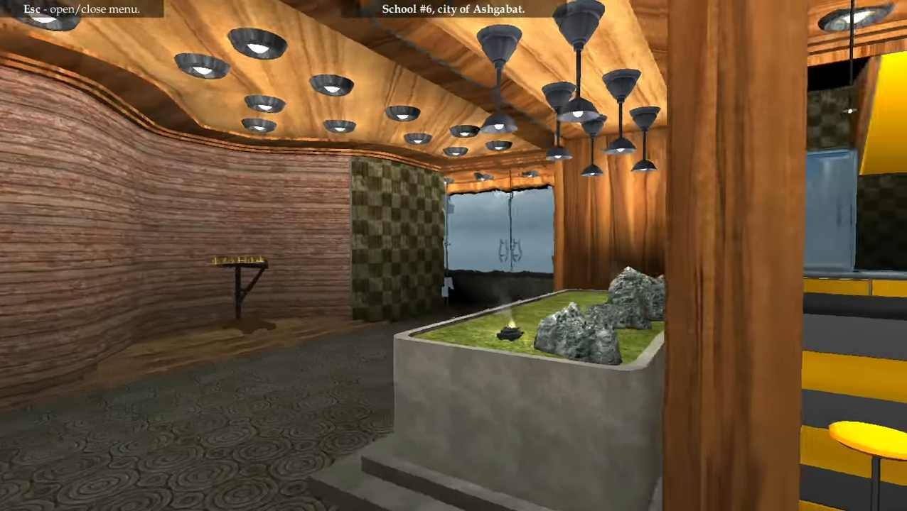
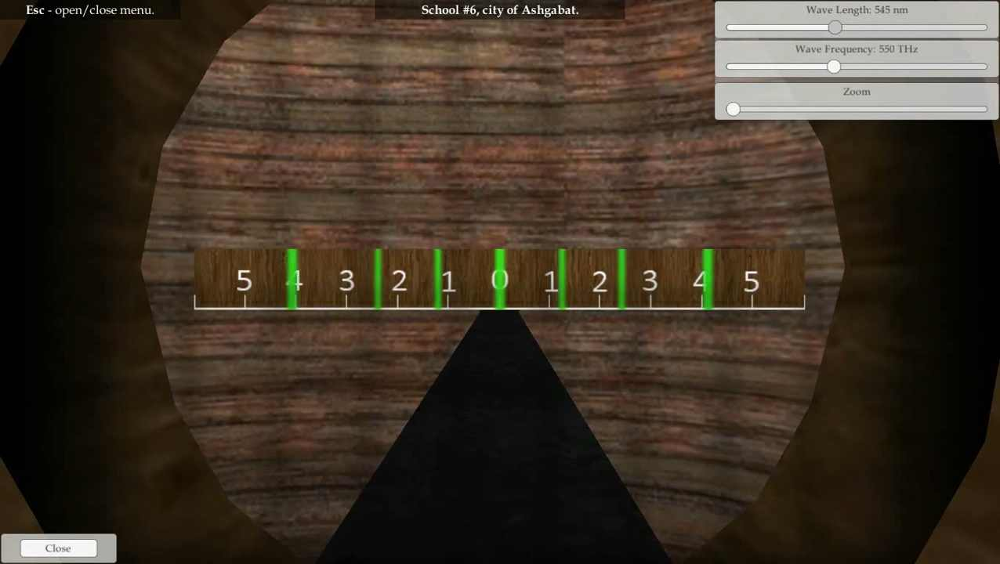

&nbsp;
&nbsp;

## Description

This app demonstrates behaviour of various physics phenomena under various conditions. You can inspect each phenomena on a separate "virtual" station, interact with slide bars, checkboxes and other UI knobs affecting the physical properties of the phenomena being inspected. This application was developed to support theory lessons with visuals and ultimately make physics classes more entertaining and engaging for students.

Application is built on Unity3D, app logic is written in C#. Visuals have been created in 3DS MAX and are available as FBX models along with the app source code in this repo. This application also has [second module](https://github.com/arkadyt/phys-pend)!

This bundle of demonstrations includes:
* Station that allows to review swing, free-fall, and other forces affecting a moving pendulum load.
* Visualization of light wave length, light wave frequency, and how both change in relation to each other.
* Demonstration of properties and forces affecting objects launched from a cannon or a slingshot-like device.

[Youtube Video](https://www.youtube.com/watch?v=0eX7hdSTzko).
[Project code](https://github.com/arkadyt/phys-bund/tree/master/Assets/Scripts).

## Download

Windows (x64): [Download](https://github.com/arkadyt/phys-bund/raw/master/Build.rar).

## License

```
The GNU General Public License v3.0 (GPLv3)

Copyright (C) 2020 Andrew Titenko

This program is free software: you can redistribute it and/or modify
it under the terms of the GNU General Public License as published by
the Free Software Foundation, either version 3 of the License, or
(at your option) any later version.

This program is distributed in the hope that it will be useful,
but WITHOUT ANY WARRANTY; without even the implied warranty of
MERCHANTABILITY or FITNESS FOR A PARTICULAR PURPOSE.  See the
GNU General Public License for more details.

You should have received a copy of the GNU General Public License
along with this program.  If not, see https://www.gnu.org/licenses/gpl-3.0.html.
```
